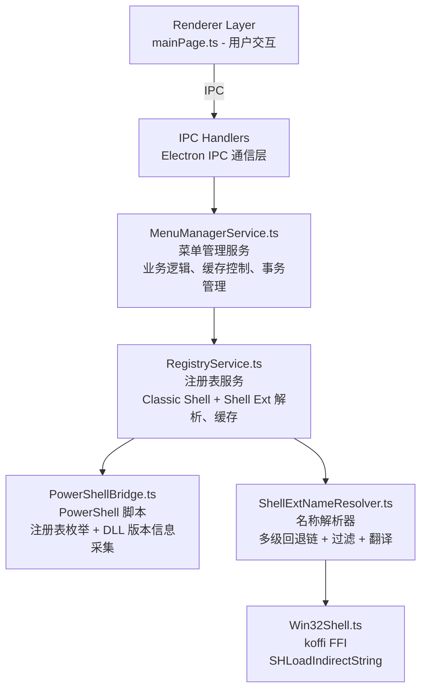
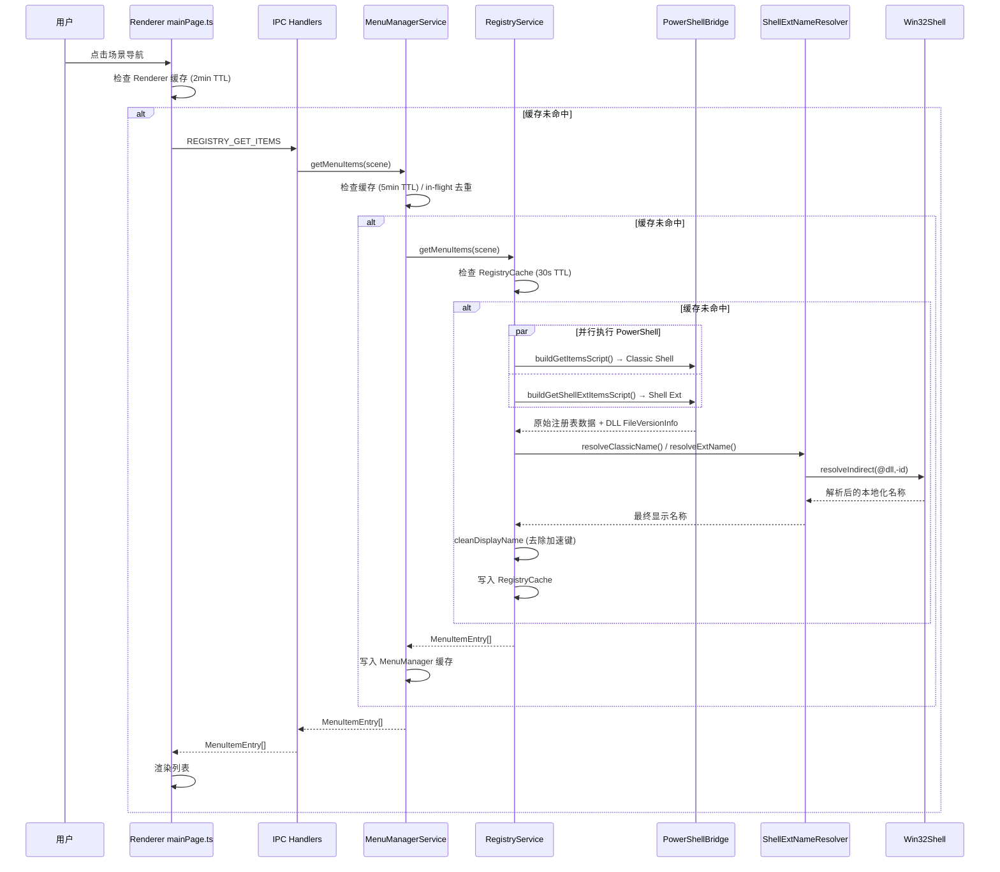

# ContextMaster 右键菜单解析完整逻辑

## 目录
1. [架构概览](#架构概览)
2. [完整数据流](#完整数据流)
3. [核心模块详解](#核心模块详解)
4. [Shell Ext 名称解析链](#shell-ext-名称解析链)
5. [缓存机制](#缓存机制)
6. [启用/禁用逻辑](#启用禁用逻辑)

---

## 架构概览

ContextMaster 的右键菜单解析采用分层架构，从 UI 到底层注册表操作分为 6 个主要层次：



> **关键设计决策**：名称解析逻辑全部在 TypeScript 侧（ShellExtNameResolver），PS 脚本只负责数据采集（注册表原始值 + DLL FileVersionInfo）。

---

## 完整数据流

### 1. 用户请求菜单列表的完整流程



### 2. 启动初始化流程

```
app.whenReady()
  → initServices()
    → new Win32Shell()           // koffi FFI 初始化，获取 UI 语言
    → new ShellExtNameResolver()  // 注入 Win32Shell
    → new CommandStoreIndex()     // 空索引
    → new RegistryService()       // 注入 resolver + cmdStoreIndex
    → ps.execute(buildCommandStoreScript())  // 异步构建 CommandStore 索引
    → registerSystemHandlers()    // IPC 注册（含诊断通道）
  → createWindow()
  → preloadAllScenes()           // 串行预热各场景
```

---

## 核心模块详解

### 1. RegistryService — 注册表服务

**文件**: `src/main/services/RegistryService.ts`

**职责**: 协调 Classic Shell 和 Shell Ext 条目读取、调用 ShellExtNameResolver 解析名称、缓存管理、启用/禁用操作、事务回滚。

**注册表路径映射**:

| 场景 | Classic Shell | Shell Extension |
|------|-------------|----------------|
| Desktop | `HKCR\DesktopBackground\Shell` | `HKCR\DesktopBackground\shellex\ContextMenuHandlers` |
| File | `HKCR\*\shell` | `HKCR\*\shellex\ContextMenuHandlers` |
| Folder | `HKCR\Directory\shell` | `HKCR\Directory\shellex\ContextMenuHandlers` |
| Drive | `HKCR\Drive\shell` | `HKCR\Drive\shellex\ContextMenuHandlers` |
| DirectoryBackground | `HKCR\Directory\Background\shell` | `HKCR\Directory\Background\shellex\ContextMenuHandlers` |
| RecycleBin | `HKCR\CLSID\{645FF040-...}\shell` | `HKCR\CLSID\{645FF040-...}\shellex\ContextMenuHandlers` |

### 2. PowerShellBridge — PowerShell 桥接

**文件**: `src/main/services/PowerShellBridge.ts`

**职责**: 构建 PowerShell 脚本、执行并解析 JSON、并发控制（信号量 max 3）、提权执行（UAC）。

**关键脚本**:

#### buildGetItemsScript — Classic Shell 条目采集

返回 `PsRawClassicItem[]`，字段：

| 字段 | 来源 | 说明 |
|------|------|------|
| `subKeyName` | 子键名 | 注册表键名 |
| `rawMUIVerb` | `MUIVerb` 值 | 可能为 @dll,-id 间接字符串 |
| `rawDefault` | `(Default)` 值 | 默认显示名 |
| `rawLocalizedDisplayName` | `LocalizedDisplayName` 值 | 本地化显示名 |
| `rawIcon` | `Icon` 值 | 图标路径 |
| `isEnabled` | `LegacyDisable` 是否为 null | 启用状态 |
| `command` | `command` 子键默认值 | 执行命令 |
| `registryKey` | 拼接的完整路径 | 注册表相对路径 |

#### buildGetShellExtItemsScript — Shell Ext 条目采集

返回 `PsRawShellExtItem[]`，字段：

| 字段 | 来源 | 说明 |
|------|------|------|
| `handlerKeyName` | 子键名 | 可能带 `-` 前缀（禁用标记） |
| `cleanName` | handlerKeyName 去 `-` 前缀 | 回退名称 |
| `defaultVal` | handler key 的 `(Default)` 值 | 通常是 CLSID 或间接字符串 |
| `actualClsid` | 从 handlerKeyName/defaultVal 推导 | CLSID 标识符 |
| `clsidLocalizedString` | `CLSID\{clsid}\LocalizedString` | 间接字符串或明文 |
| `clsidMUIVerb` | `CLSID\{clsid}\MUIVerb` | 间接字符串或明文 |
| `clsidDefault` | `CLSID\{clsid}\(Default)` | CLSID 默认名称 |
| `dllPath` | `CLSID\{clsid}\InprocServer32\(Default)` | 已展开环境变量 |
| `dllFileDescription` | DLL 的 `FileVersionInfo.FileDescription` | .NET 采集，UI 语言 |
| `dllProductName` | DLL 的 `FileVersionInfo.ProductName` | .NET 采集，UI 语言 |
| `progIdName` | `CLSID\{clsid}\ProgID` → `HKCR\{ProgID}\(Default)` | 应用程序名 |
| `siblingMUIVerb` | `HKCR\{type}\shell\{cleanName}\MUIVerb` | 同级 shell key |
| `registryKey` | 拼接的完整路径 | 注册表相对路径 |

> **DLL 版本信息采集**：使用 PS 的 `[System.Diagnostics.FileVersionInfo]::GetVersionInfo()` 读取 FileDescription 和 ProductName，**天然支持 UI 语言**，无需 koffi FFI。`dllPath` 在 PS 中通过 `[Environment]::ExpandEnvironmentVariables()` 展开。

#### buildCommandStoreScript — CommandStore 索引构建

扫描 `HKLM\SOFTWARE\Microsoft\Windows\CurrentVersion\Explorer\CommandStore\shell`，返回 `{clsid, muiverb}[]`。启动时异步执行一次，存入 `CommandStoreIndex`。

### 3. ShellExtNameResolver — 名称解析器

**文件**: `src/main/services/ShellExtNameResolver.ts`

**职责**: 解析 Classic Shell 和 Shell Ext 显示名称、标准动词翻译、泛型名称过滤、CommandStore 索引管理。

#### Classic Shell 名称解析 (`resolveClassicName`)

```
1. rawMUIVerb     → @/ms-resource: → SHLoadIndirectString (间接) 或直接返回 (明文)
2. rawDefault      → @/ms-resource: → SHLoadIndirectString 或直接返回
3. rawLocalizedDisplayName → 同上
4. 标准动词翻译     → translateStandardVerb(subKeyName)
5. subKeyName      → 最终兜底
```

#### Shell Ext 名称解析 (`resolveExtName`) — 见下一节完整解析链

#### 泛型名称过滤 (`isGenericName`)

6 组正则规则（Group A-D），过滤无信息量的 COM/Shell 技术描述：

| 规则组 | 匹配示例 | 说明 |
|--------|---------|------|
| Group A | `context menu`, `shell extension`, `外壳服务对象`, `*.dll`, `microsoft windows *` | COM/Shell 技术内部描述 |
| Group B | `* Class` | COM 类名后缀 |
| Group C | `TODO:`, `<placeholder>`, `n/a`, `none`, `unknown` | 占位符/无效值 |
| Group D | `^(a\|an\|the) ` 开头句子, `^(...)$` 括号包裹 | 句子描述/调试标记 |

#### 标准动词翻译 (`translateStandardVerb`)

35 个标准 shell 动词的中英文翻译表：`open→打开`, `edit→编辑`, `runas→以管理员身份运行`, `sendto→发送到`, `pintotaskbar→固定到任务栏` 等。

语言选择由 `GetUserDefaultUILanguage()` 决定（中文 Window → `'zh'`，其他 → `'en'`）。

#### CommandStore 索引 (`CommandStoreIndex`)

- `buildFromData()`: 从 PS 返回的 `{clsid, muiverb}[]` 构建 CLSID→MUIVerb 映射
- `get(clsid)`: 大小写不敏感查找
- `size`: 当前条目数
- 启动时异步构建，不影响首次加载

### 4. Win32Shell — Windows API 封装

**文件**: `src/main/services/Win32Shell.ts`

**职责**: 封装 `SHLoadIndirectString` (shlwapi.dll) 通过 koffi FFI，获取用户 UI 语言。

**接口** (`IWin32Shell`):

```typescript
interface IWin32Shell {
  resolveIndirect(source: string): string | null;
  readonly uiLanguage: 'zh' | 'en';
}
```

`resolveIndirect` 实现：
```
1. 检查 source 是否以 @ 或 ms-resource: 开头
2. Buffer.alloc(2048) 分配输出缓冲区
3. koffi 调用 SHLoadIndirectString(source, buf, 1024, null)
4. HRESULT=0 → buf.toString('utf16le') 读取结果
5. 缓存结果（间接字符串 → 解析后名称）
```

> **注意**：DLL 版本信息读取从 Win32Shell 移除。原 koffi 实现的 `GetFileVersionInfo` 历经多次修复仍不稳定（解构失败 / 参数数量不匹配 / segfault），改为 PS 内联 `.NET FileVersionInfo` 采集。

---

## Shell Ext 名称解析链

完整的多级回退链，按优先级分为三个阶段：

### Phase A: 间接格式（最高优先级，返回系统语言名称）

| Level | 数据源 | 处理方式 |
|-------|--------|---------|
| 0 | handler `defaultVal` @/ms-resource: | `SHLoadIndirectString` |
| 1-indirect | `CLSID.LocalizedString` @/ms-resource: | `SHLoadIndirectString` |
| 1.3-indirect | sibling shell key `MUIVerb` @/ms-resource: | `SHLoadIndirectString` |
| 1.5-indirect | `CLSID.MUIVerb` @/ms-resource: | `SHLoadIndirectString` |

### Phase B: Windows 本地化机制（次优先级）

| Level | 数据源 | 说明 |
|-------|--------|------|
| 1.7 | CommandStore 反向索引 | ExplorerCommandHandler CLSID → MUIVerb，解析 `@/ms-resource:` |
| 1.6 | ProgID 链 | `CLSID.ProgID` → `HKCR\{ProgID}\(Default)` → 应用程序名 |

### Phase C: Plain text 回退（最低优先级，可能是英文）

| Level | 数据源 | 处理方式 |
|-------|--------|---------|
| 1-plain | `CLSID.LocalizedString` 明文 | `isUselessPlain` 过滤 |
| 1.3-plain | sibling shell key `MUIVerb` 明文 | `isUselessPlain` 过滤 |
| 1.5-plain | `CLSID.MUIVerb` 明文 | `isUselessPlain` 过滤 |
| 2 | `CLSID.(Default)` | `isUselessPlain` 过滤 |
| 2.5 | DLL `FileDescription` → `ProductName` | `isGenericName` 过滤 + 不等于 fallback |
| 3 | handler `defaultVal` 明文 | `isUselessPlain` 过滤 |

### 最终兜底

| 步骤 | 处理 |
|------|------|
| 标准动词翻译 | `translateStandardVerb(cleanName)` — open→打开 等 |
| Fallback | `cleanName` — 注册表键名 |

### 代表案例

| 扩展 | 解析路径 | 结果 |
|------|---------|------|
| Open With (`{09799AFB-...}`) | Level 0: `@shell32.dll,-8510` → SHLoadIndirectString | "打开方式" |
| Taskband Pin (`{90AA3A4E-...}`) | Level 1.7: CommandStore `@shell32.dll,-37423` → resolveIndirect | "固定到任务栏" |
| Portable Devices (`{D6791A63-...}`) | Level 1: `@wpdshext.dll,-511` → SHLoadIndirectString | "便携设备菜单" |
| YunShellExt (百度网盘) | Level 1.6: ProgID → "百度网盘" (预期) 或 Level 2.5: DLL ProductName | TBD |
| BitLocker | Level 0: `@fvewiz.dll,-971` → SHLoadIndirectString | "更改 BitLocker 密码" |
| gvim | Level 1.3: sibling `MUIVerb` "用Vim编辑" | "用Vim编辑" |
| 标准动词 (find/open/edit) | Fallback: `translateStandardVerb` | "搜索/打开/编辑" |

---

## 缓存机制

### 三级缓存架构

```
1. Renderer Cache (mainPage.ts)
   ├─ TTL: 2 分钟
   ├─ stale-while-revalidate (剩余 <30s 时后台刷新)
   └─ 场景隔离

2. MenuManager Cache (MenuManagerService.ts)
   ├─ TTL: 5 分钟
   ├─ in-flight 去重 (防止并发重复请求)
   └─ 场景隔离

3. Registry Cache (RegistryService.ts via RegistryCache.ts)
   ├─ TTL: 30 秒
   ├─ 场景隔离
   └─ 命中/未命中/淘汰统计
```

### 缓存失效时机

- 单个条目切换 (enable/disable) → `invalidateCache(scene)`
- 批量操作 → `invalidateAllCache()`
- 备份还原 → `invalidateAllCache()`
- 应用启动 → 无缓存，首次加载 + preloadAllScenes 预热

---

## 启用/禁用逻辑

### Classic Shell 条目

```
启用: 删除 LegacyDisable 字符串值
禁用: 设置 LegacyDisable = "" (空字符串)
```

### Shell Ext 条目

```
启用: 重命名键 "-Name" → "Name"
禁用: 重命名键 "Name" → "-Name"
registryKey 不变 (已归一化为不带 '-' 前缀)
```

### 事务与回滚

```typescript
// 批量操作前: createRollbackPoint(items)
//   → 记录所有条目原始 isEnabled 状态
// 逐条执行
// 成功: commitTransaction() → 清除回滚数据
// 失败: rollback() → 逐条恢复原始状态
```

---

## 数据结构

### 关键接口

```typescript
// PS 返回的 Classic Shell 原始数据
interface PsRawClassicItem {
  subKeyName: string;
  rawMUIVerb: string | null;
  rawDefault: string | null;
  rawLocalizedDisplayName: string | null;
  rawIcon: string | null;
  isEnabled: boolean;
  command: string;
  registryKey: string;
}

// PS 返回的 Shell Ext 原始数据
interface PsRawShellExtItem {
  handlerKeyName: string;
  cleanName: string;
  defaultVal: string;
  isEnabled: boolean;
  actualClsid: string;
  clsidLocalizedString: string | null;
  clsidMUIVerb: string | null;
  clsidDefault: string | null;
  dllPath: string | null;
  dllFileDescription: string | null;
  dllProductName: string | null;
  progIdName: string | null;
  siblingMUIVerb: string | null;
  registryKey: string;
}

// 最终输出的菜单条目
interface MenuItemEntry {
  id: number;
  name: string;
  command: string;
  iconPath: string | null;
  isEnabled: boolean;
  source: string;
  menuScene: MenuScene;
  registryKey: string;
  type: MenuItemType;   // System | Custom | ShellExt
  dllPath?: string | null;
}

enum MenuItemType {
  System,    // 系统内置 (无 command)
  Custom,    // 自定义 (有 command)
  ShellExt,  // Shell 扩展 (COM)
}
```

---

## 诊断与调试

### IPC 诊断通道 (`sys:diagnose`)

设置页隐藏诊断按钮，点击后调用 IPC 返回：

```json
{
  "koffiAvailable": true,
  "resolveIndirectResult": "固定到任务栏",
  "uiLanguage": "zh",
  "cmdStoreSize": 67
}
```

### ResolveTrace 日志

每次 `getMenuItems` 输出每条 ShellExt 条目的完整解析信息（`[ResolveTrace]` 前缀）：

```
[ResolveTrace] File | "固定到任务栏" ← cleanName="{90AA3A4E-...}"
  clsid=... dll=C:\...\shell32.dll clsidDef="Taskband Pin"
  clsidLS="" clsidMUI="" progId="" dllDesc="" dllProd=""
  siblingMUI="" defVal="Taskband Pin"
```

---

## 性能优化

1. **并发控制**: PowerShellBridge 信号量 (max 3)，支持 high/normal 优先级
2. **缓存分层**: 三级缓存，TTL 递减 (30s → 5min → 2min)
3. **并行读取**: Classic + ShellExt PS 脚本并行执行
4. **Stale-while-revalidate**: Renderer 缓存命中后台刷新
5. **预加载**: 启动时串行预热所有 6 个场景
6. **in-flight 去重**: 避免并发重复请求
7. **间接字符串缓存**: Win32Shell 内对 `resolveIndirect` 结果无限缓存

---

## 错误处理

1. **单条失败不影响整体**: RegistryService 逐条 try-catch 保护
2. **PS 失败非致命**: ShellExt 读取失败返回 `[]`，记录 warn 日志
3. **名称解析失败回退**: 多层 fallback 链，最终回到 cleanName
4. **koffi 初始化失败降级**: `koffiAvailable=false`，`resolveIndirect` 直接返回 null
5. **事务回滚机制**: 批量操作失败自动回滚
6. **IPC 统一错误包装**: `IpcResult<T> = { success: true, data } | { success: false, error }`
