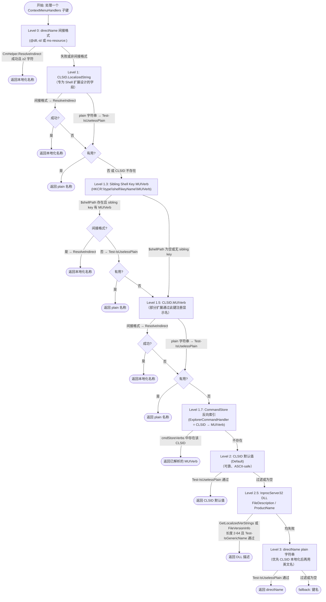

# Shell 扩展名称解析策略

## 概述

右键菜单 Shell 扩展（`shellex\ContextMenuHandlers`）的名称来源复杂：有的扩展通过 CLSID 的 `LocalizedString` 注册本地化名称，有的只有 DLL 的 `FileDescription`，还有的同时在 `shell` 键注册了 verb。

多级回退策略的目标是：**优先使用最精确的本地化名称，对无信息量的字符串过滤并降级，最终兜底到键名**。

CmHelper（编译缓存于 `%LOCALAPPDATA%\ContextMaster\CmHelper.dll`）提供两个核心能力：
1. `ResolveIndirect`：调用 `SHLoadIndirectString`，解析 `@dll,-id` 和 `ms-resource:` 格式的间接字符串
2. `GetLocalizedVerStrings`：读取 DLL 的版本资源并按 UI 语言排序，返回 `[FileDescription, ProductName]`

当 CmHelper 编译失败时（如 .NET SDK 不可用），这两个路径被阻断，系统退化到 `FileVersionInfo`（仅支持当前线程 locale）和键名兜底。

---

## 完整解析流程



---

## 各 Level 详解

### Level 0 — directName 间接格式

**触发条件**：键的默认值（当键名是 CLSID 格式时使用默认值作为 directName）以 `@` 或 `ms-resource:` 开头。

**数据来源**：handler key 的默认值（非 CLSID 格式字符串）。

**过滤规则**：`CmHelper.ResolveIndirect` 成功且结果 ≥ 2 字符。

**示例**：`{...CLSID...}` 键的默认值为 `@shell32.dll,-8510` → "打开方式"。

---

### Level 1 — CLSID.LocalizedString

**触发条件**：CLSID 路径下存在 `LocalizedString` 值。

**数据来源**：`HKCR\CLSID\{...}\LocalizedString`

**过滤规则**：
- 间接格式：`ResolveIndirect` 成功且 ≥ 2 字符
- plain 字符串：`Test-IsUselessPlain`（含等于键名、泛型描述等检查）

**设计说明**：`LocalizedString` 是 Windows Shell 专为右键菜单扩展设计的字段，自动支持多语言，是最可靠的本地化来源。`FriendlyTypeName` 已从解析链中移除（它描述 COM 类型，如"外壳服务对象"，非用户可见名称）。

---

### Level 1.3 — Sibling Shell Key MUIVerb *(新增)*

**触发条件**：
1. `$shellexPath` 以 `\shellex\ContextMenuHandlers` 结尾（`$shellPath` 非空）
2. `HKCR\<type>\shell\<keyName>` 路径存在

**数据来源**：`HKCR\<type>\shell\<keyName>\MUIVerb`，其中 `<type>` 由 `$shellexPath` 推导，`<keyName>` 为当前处理的键名（fallback）。

**过滤规则**：与 Level 1.5 相同（间接格式走 `ResolveIndirect`，plain 走 `Test-IsUselessPlain`）。

**设计说明**：部分扩展（如 gvim）既通过 `shellex\ContextMenuHandlers` 注册 COM 处理器，又通过 `shell\gvim` 注册 static verb，后者的 `MUIVerb` 就是菜单实际显示的文字。此 Level 不依赖 CmHelper 即可获取 plain MUIVerb，提供了一条不受 CmHelper 编译状态影响的可靠路径。

**代表案例**：
| 案例 | shellex 路径 | sibling shell 路径 | MUIVerb |
|------|------------|-------------------|---------|
| gvim | `HKCR:\*\shellex\ContextMenuHandlers\gvim` | `HKCR:\*\shell\gvim` | `用Vim编辑` |

---

### Level 1.5 — CLSID.MUIVerb

**触发条件**：CLSID 路径下存在 `MUIVerb` 值。

**数据来源**：`HKCR\CLSID\{...}\MUIVerb`

**过滤规则**：同 Level 1（间接/plain 分别处理）。

---

### Level 1.7 — CommandStore 反向索引

**触发条件**：CommandStore 预建索引中存在该 CLSID（即该 CLSID 作为某 verb 的 `ExplorerCommandHandler`）。

**数据来源**：`HKLM\SOFTWARE\Microsoft\Windows\CurrentVersion\Explorer\CommandStore\shell\*\ExplorerCommandHandler` → 对应 verb 的 `MUIVerb`（已在预建时解析）。

**设计说明**：适用于通过 `ImplementsVerbs` 注册的新式 shell 扩展（如 Taskband Pin），这类扩展在 CLSID 自身不设置 `LocalizedString`，而是通过 CommandStore 关联到具有 `MUIVerb` 的 verb 定义。

---

### Level 2 — CLSID 默认值

**触发条件**：`HKCR\CLSID\{...}` 的默认值非空。

**数据来源**：CLSID 主键的 `(Default)` 值。

**过滤规则**：`Test-IsUselessPlain`（含等于键名检查，避免开发者用键名作为 COM 类描述）。

---

### Level 2.5 — InprocServer32 DLL 版本信息

**触发条件**：`HKCR\CLSID\{...}\InprocServer32` 存在且 DLL 文件可访问。

**数据来源**：
1. `CmHelper.GetLocalizedVerStrings`：优先使用 UI 语言对应的 Translation 条目（返回 `[FileDescription, ProductName]`）
2. 降级：`System.Diagnostics.FileVersionInfo::GetVersionInfo`（使用线程 locale）

**过滤规则**：
- 长度：≥ 2 且 ≤ 64 字符
- `Test-IsGenericName`：排除所有泛型描述（含 Group A–D）

**代表案例**：
| 案例 | DLL | FileDescription |
|------|-----|----------------|
| YunShellExt | YunShellExt64.dll | 阿里云盘 |
| WinRAR | rarext.dll | WinRAR shell extension → 被 Group A 过滤 |

---

### Level 3 — directName plain 字符串

**触发条件**：`directName` 非空且非间接格式（不以 `@`/`ms-resource:` 开头）。

**数据来源**：handler key 的默认值（通常是英文名称，如 "Edit with Notepad++"）。

**过滤规则**：`Test-IsUselessPlain`（含等于键名检查：如果英文名就是键名本身，无额外信息量则过滤）。

**设计说明**：Level 3 在 CLSID 查询链之后，确保优先使用本地化名称；仅当所有 CLSID 来源均失败时，才使用英文 directName。

---

### Fallback — 键名

当所有 Level 均失败时，返回 `$fallback`（处理程序键名），如 `gvim`、`YunShellExt`。

---

## 过滤函数说明

### Test-IsGenericName

判断字符串是否为无意义的泛型描述，返回 `$true` 表示应过滤：

| 规则组 | 匹配示例 | 说明 |
|--------|---------|------|
| Group A | `context menu`、`shell extension`、`外壳服务对象` | COM/Shell 技术内部描述 |
| Group A | `Vim Shell Extension` | "* Shell Extension" 后缀（COM 类描述） |
| Group A | `microsoft windows *` | 系统内部描述 |
| Group A | `*.dll` | 文件名（非友好名称） |
| Group B | `* Class` | COM 类名（如 `PcyybContextMenu Class`） |
| Group C | `TODO: <desc>` | 未完成的占位符 |
| Group C | `<placeholder>` | 尖括号模板占位符 |
| Group C | `n/a`、`none`、`unknown` | 通用无效值 |
| Group D | `A small project for the context menu of gvim!` | 冠词（a/an/the）开头的句子 |
| Group D | `(调试)`、`(Debug)` | 括号完全包裹的调试/临时标记 |

### Test-IsUselessPlain

在 `Test-IsGenericName` 基础上额外检查：
- 字符串为空或长度 < 2
- 字符串（不区分大小写）等于键名（fallback）—— 开发者用键名作占位符

---

## 代表案例分析

### gvim — CmHelper 失败时的完整降级链

```
Level 0  : @gvimext.dll,-101 → CmHelper 失败 → skip
Level 1  : CLSID.LocalizedString 不存在 → skip
Level 1.3: HKCR:\*\shell\gvim\MUIVerb = "用Vim编辑" → 返回 ✓
```

若 Level 1.3 也失败（sibling key 不存在）：
```
Level 1.5: CLSID.MUIVerb 不存在 → skip
Level 1.7: CommandStore 无索引 → skip
Level 2  : CLSID.Default = "gvim" → 等于键名 → Test-IsUselessPlain 过滤
Level 2.5: gvimext.dll FileDescription = "Vim Shell Extension" → Group A 过滤
Level 3  : directName 不存在 → skip
Fallback : "gvim"
```

### Open With（打开方式）— LocalizedString 路径

```
Level 0  : @shell32.dll,-8510 → CmHelper 正常 → "打开方式" ✓
```

CmHelper 失败时：
```
Level 1  : CLSID.LocalizedString = @shell32.dll,-8510 → CmHelper 失败 → skip
Level 1.3: 无 sibling shell key → skip
Level 1.5: CLSID.MUIVerb 若有 "(调试)" → Group D 括号过滤 → skip
Level 2.5: shell32.dll FileDescription = "Windows Shell Common Dll" → Group A 过滤
Fallback : 键名
```

### YunShellExt — DLL 路径

```
Level 1  : CLSID.LocalizedString 不存在 → skip
Level 1.3: 无 sibling shell key → skip
Level 1.5: CLSID.MUIVerb 不存在 → skip
Level 2  : CLSID.Default 不存在 → skip
Level 2.5: YunShellExt64.dll FileDescription = "阿里云盘" ✓
```

### Taskband Pin — CommandStore 路径

```
Level 1  : CLSID.LocalizedString 不存在 → skip
Level 1.3: 无 sibling shell key → skip
Level 1.5: CLSID.MUIVerb 不存在 → skip
Level 1.7: cmdStoreVerbs[CLSID] = "固定到任务栏" ✓
```

---

## CmHelper 编译与缓存

CmHelper 是一个 C# 类，在脚本运行时动态编译（或从缓存加载）。缓存路径：`%LOCALAPPDATA%\ContextMaster\CmHelper.dll`。

**版本校验**：加载 DLL 后立即检查 `[CmHelper]::Ver == "2026.3"`，不匹配时重新编译。这确保代码变更后自动更新缓存。

**编译失败时的降级行为**：
- `ResolveIndirect` 不可用 → Level 0、Level 1（间接格式）、Level 1.3（间接格式）、Level 1.5（间接格式）失败
- `GetLocalizedVerStrings` 不可用 → Level 2.5 降级为 `FileVersionInfo`（仅当前 locale）
- 其余 Level（plain 字符串路径）不受影响
